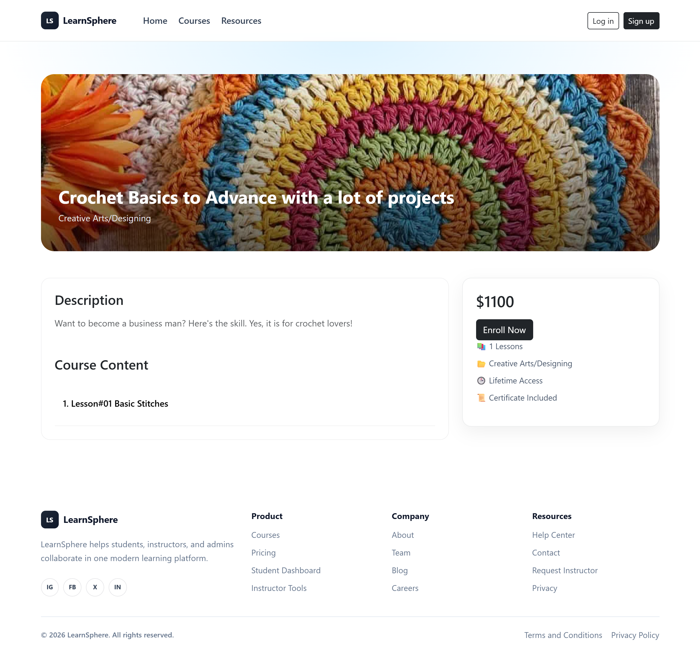
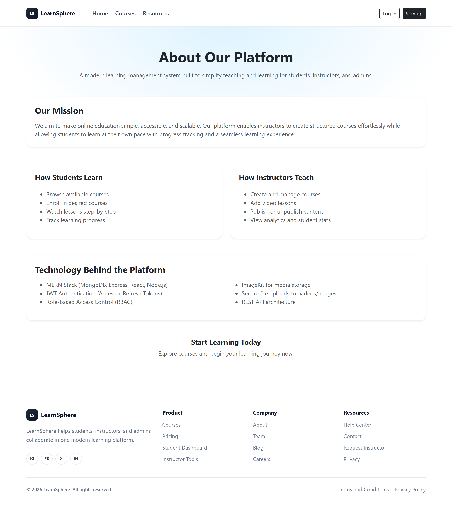
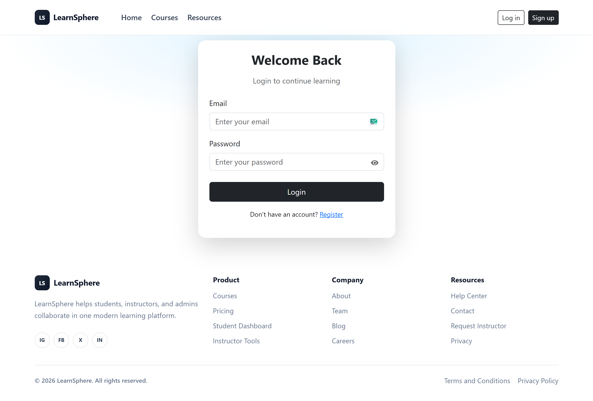
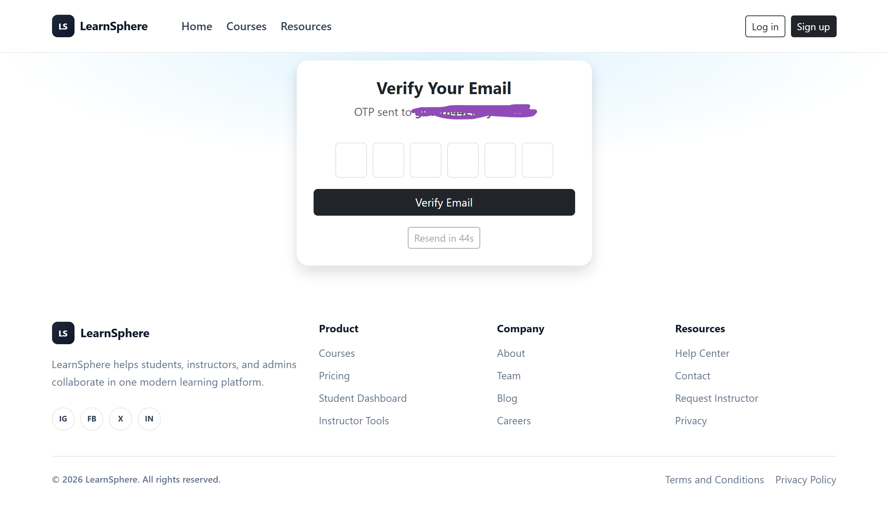
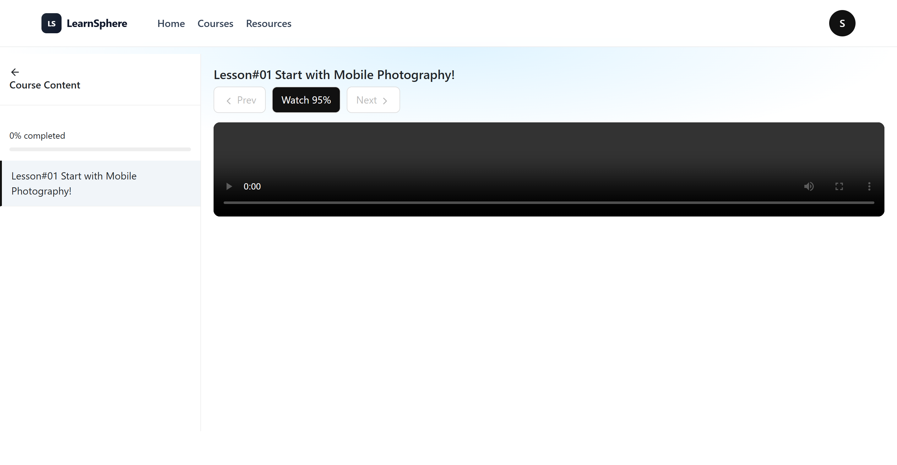
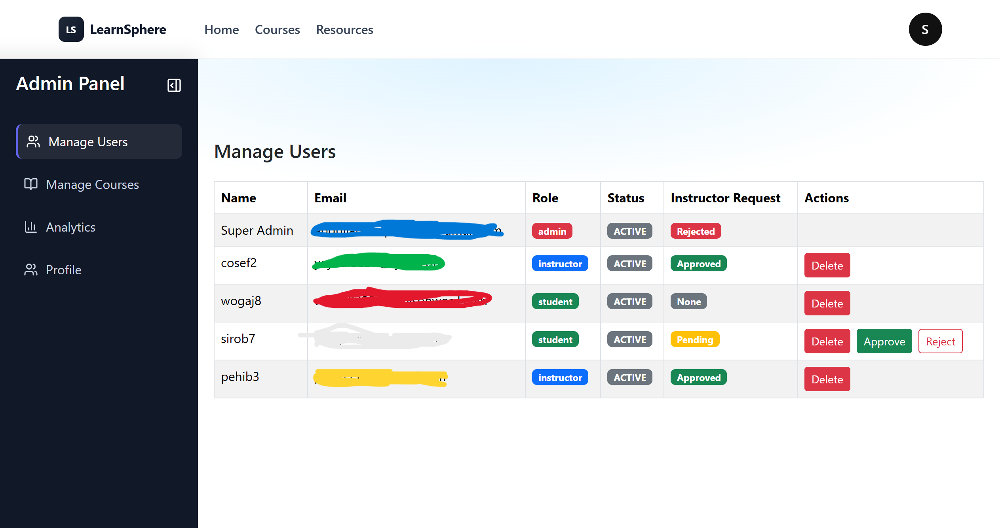
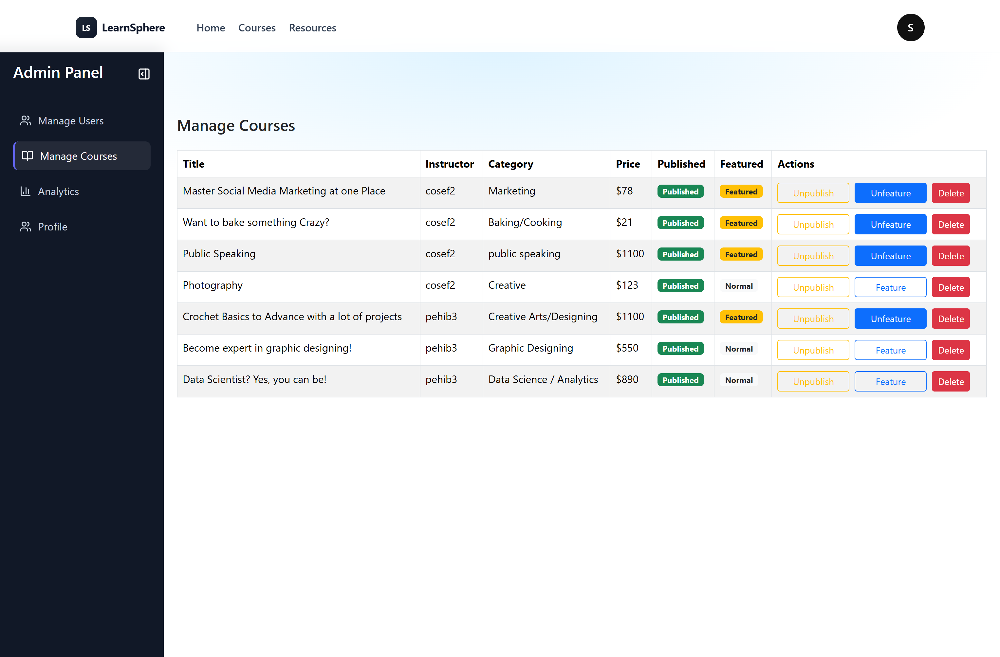

## 🌐 Live Demo
 [🚀 Experience the application live](https://hunarmandproject.netlify.app/)

# 🚀 Full Fledged MERN Stack Learning Management System (LMS)

## 📌 Project Overview

This project is a **full-stack Learning Management System (LMS)** built using the **MERN stack**. It provides a complete platform for **students, instructors, and administrators** to interact, manage courses, and track learning progress.

Unlike basic LMS implementations, this system includes **advanced authentication, security mechanisms, analytics, and real-world workflows**, making it closer to a **production-level application**.

---

## 🎯 Key Features

### 👥 Role-Based System

#### 🛡️ Admin

* Login
* Manage all users
* Approve/reject instructor requests
* Delete users and courses
* View platform analytics
* Control course publishing
* ⭐ Feature / Unfeature courses
* Profile management (Change Email, Password)
* Handle instructor access requests

#### 👨‍🏫 Instructor

* Login
* Create, update, and delete courses
* Upload lessons (video + content)
* Publish / Unpublish courses
* View instructor analytics
* Profile management (Change Email, Password, Danger Zone)

#### 👨‍🎓 Student

* Register & Login
* Email Verification (OTP)
* Enroll in courses
* Track learning progress
* Mark lessons as completed
* Request instructor role
* Profile management (Change Email, Password, Danger Zone)

---

## 🔐 Advanced Authentication & Security 🔥

### ✅ JWT + Refresh Token System

* Short-lived Access Tokens
* Secure Refresh Tokens (HTTP-only cookies)
* Token rotation for enhanced security

### 🔄 Session-Based Authentication

* Each login creates a session
* Tracks:

  * IP Address
  * Device (User-Agent)
* Supports:

  * Logout (single device)
  * Logout from all devices

### 🚨 Token Reuse Detection

* Detects compromised refresh tokens
* Automatically revokes all sessions

### 📧 OTP Email Verification

* Secure OTP-based verification
* Hashed OTP storage
* Expiry + resend cooldown

### 🔐 Account Security Features

* Change password (revokes all sessions)
* Delete account (cascade cleanup)
* Email change with OTP verification
* Cancel email change request

---

## 📚 Course Management System

### 🎓 Instructor Features

* Create courses with:

  * Title, description, category, price
  * Thumbnail upload
* Add lessons:

  * Video upload
  * Content
  * Auto-detected duration
* Publish courses (only if lessons exist)

### ☁️ Cloud Media Upload

* Integrated with **ImageKit**
* Supports:

  * Thumbnail uploads
  * Video uploads
* Automatic deletion of old media on update

---

## 📊 Analytics Dashboard 🔥

### 👑 Admin Analytics

* Total users, courses, enrollments
* Role-based statistics
* Growth tracking (daily aggregation)

### 👨‍🏫 Instructor Analytics

* Total courses created
* Published courses
* Students per course

---

## 🎯 Enrollment & Progress Tracking

* Prevents duplicate enrollments
* Tracks:

  * Completed lessons
  * Progress percentage
  * Course completion status

---

## 🛡️ Security Features

* Password hashing using **bcrypt**
* API rate limiting
* Role-based authorization middleware
* Input validation using **Zod**
* Secure headers via **Helmet**
* CORS configuration
* Cookie-based authentication

---

## ⚙️ Backend Architecture

```
Backend/
│
├── src/
│   ├── config/
│   ├── controllers/
│   ├── middlewares/
│   ├── models/
│   ├── routes/
│   ├── services/
│   ├── utils/
│   ├── validations/
│   └── app.js
│
├── scripts/
│   └── seedAdmin.js
│
├── server.js
└── .env.example
```

---

## 🔌 API Endpoints

### 🔐 Authentication

* POST `/api/auth/register`
* POST `/api/auth/login`
* GET `/api/auth/get-me`
* GET `/api/auth/refresh-token`
* GET `/api/auth/logout`
* GET `/api/auth/logout-all`

### 📧 OTP & Account

* POST `/api/auth/verify-email`
* POST `/api/auth/resend-otp`
* POST `/api/auth/change-password`
* DELETE `/api/auth/delete-account`
* POST `/api/auth/request-email-change`
* POST `/api/auth/confirm-email-change`
* POST `/api/auth/cancel-email-change`

### 📚 Courses

**Public**

* GET `/api/courses`
* GET `/api/courses/:id`

**Instructor**

* POST `/api/courses`
* PUT `/api/courses/:id`
* DELETE `/api/courses/:id`
* POST `/api/courses/:id/lesson`
* PUT `/api/courses/:id/publish`
* GET `/api/courses/instructor/my-courses`
* GET `/api/courses/instructor/stats`

### 🎓 Enrollment

* POST `/api/enrollments/:courseId`
* GET `/api/enrollments/my-courses`
* POST `/api/enrollments/complete-lesson`

### 👤 Instructor Request

* POST `/api/users/request-instructor`

### 👑 Admin

* GET `/api/admin/users`
* DELETE `/api/admin/users/:id`
* PUT `/api/admin/approve-instructor/:id`
* PUT `/api/admin/reject-instructor/:id`
* GET `/api/admin/courses`
* DELETE `/api/admin/courses/:id`
* GET `/api/admin/analytics`
* PUT `/api/admin/courses/:id/toggle-publish`
* PUT `/api/admin/courses/:id/featured`

---

## 🗄️ Database Models

### 👤 User

* username, email, password
* role (admin/instructor/student)
* verified, accountStatus, pendingEmail
* instructorRequest

### 📚 Course

* title, description, category, price
* instructor reference
* lessons (embedded)
* thumbnail, isPublished
* isFeatured, thumbnailFileId

### 🎓 Enrollment

* student reference
* course reference
* progress tracking
* completed, completedLessons

### 🔐 Session

* user reference
* refresh token hash
* device tracking
* revocation support

### 📧 OTP

* hashed OTP + expiry

---

## 🛠️ Technologies Used

* Node.js
* Express.js
* MongoDB + Mongoose
* JWT Authentication
* Bcrypt
* Zod Validation
* Nodemailer
* ImageKit
* Helmet
* Express Rate Limit

---

## ⚙️ Installation & Setup

### 1️⃣ Clone Repository

```bash
git clone <your-repo-link>
cd Backend
```

### 2️⃣ Install Dependencies

```bash
npm install
```

### 3️⃣ Setup Environment Variables

Create `.env` file:

```
MONGO_URI=<Your MONGO_URI>
JWT_SECRET = <Your JWT_SECRET>

GOOGLE_APP_PASSWORD = <Your GOOGLE_APP_PASSWORD>
GOOGLE_USER= <Your GOOGLE_USER>

EMAIL_ADMIN= <Your EMAIL_ADMIN>
ADMIN_PASSWORD= <Your ADMIN_PASSWORD>

IMAGEKIT_PRIVATE_KEY= <Your IMAGEKIT_PRIVATE_KEY>
```

### 4️⃣ Run Admin Seeder

```bash
node scripts/seedAdmin.js
```

### 5️⃣ Start Server

```bash
npm run dev
```

---

## 🎨 Frontend Features

The frontend is built using React.js with a focus on clean UI/UX, responsiveness, and role-based navigation.

### ✨ UI/UX Enhancements
- Responsive design using React Bootstrap
- Mobile-friendly navigation with Offcanvas menu
- Clean and modern UI with consistent spacing and layout
- Full-page screenshots supported for documentation

### 🔔 Toast Notification System
- Integrated using React Toastify
- Supports:
  - Success messages
  - Error messages
  - Informational alerts
- Customized for light theme

### 🔐 Authentication UI Handling
- Role-based navigation rendering
- Protected routes using custom `ProtectedRoute`
- Auto login using refresh token
- Session persistence

### 👤 Profile Dropdown
- Dynamic avatar based on username
- Dashboard navigation based on role
- Logout (single device)
- Logout from all devices (with confirmation modal)

### 📚 Course UI Features
- Featured Courses carousel on Home Page
- Course filtering (search)
- Course details page
- Enrollment system UI

### 📱 Responsive Design
- Separate mobile UI using:
  - Offcanvas menu
  - Mobile cards for tables
- Adaptive layouts for different screen sizes

### ⚡ API & State Management
- Axios interceptors for token authentication
- Automatic refresh token handling
- Centralized API service layer
- React Context API for authentication state management

---
## ⚙️ Frontend Setup

### 1️⃣ Navigate to frontend folder:
```bash
cd Frontend
```
### 2️⃣ Install Dependencies

```bash
npm install
```
### 3️⃣ Start development server:

```bash
npm run dev
```
---
## 📸 Screenshots

* 🏠 Public Pages

### Home Page


### Courses Page


### Course Details


### About Page
 

### Sign Up Page


### Login Page 


* After Sign Up

### Verify Email Page
 

### Logged In Home Page


* Student Dashboard Pages

### Dashboard


### My Courses Page
 

### Continue Course Page


### Profile Page


### Instructor Access Section


### Request Rejected


* Instructor Dashboard

### Instructor Analytics
.png)
.png)
.png)

### Manage Courses
.png)

### Edit Courses
.png)

### Add Lesson in Courses
.png)

### Create Course


### Instructor Profile


* Admin Dashboard

### Manage Users


### Manage Courses


### Analytics
.png)
.png)
.png)
.png)

### Admin Profile
- without Instructor Access Section


---

## 🚀 Future Improvements

* Payment integration
* Course reviews & ratings
* Live classes
* Notification system

---

## 🧠 Project Summary

This LMS is a production-style full-stack application implementing:
- Scalable backend architecture
- Secure authentication system
- Role-based access control
- Modular and maintainable frontend design

---

## 📌 Author

Developed as part of MERN Stack Final Project

---

**Disclaimer**

All images, videos, and other media used in this project are the property of their respective owners and are not owned by me. These resources have been included solely for educational and demonstration purposes as part of a course project.

No copyright infringement is intended. If any content owner has concerns regarding the use of their material, please feel free to contact me, and I will promptly address the issue.

